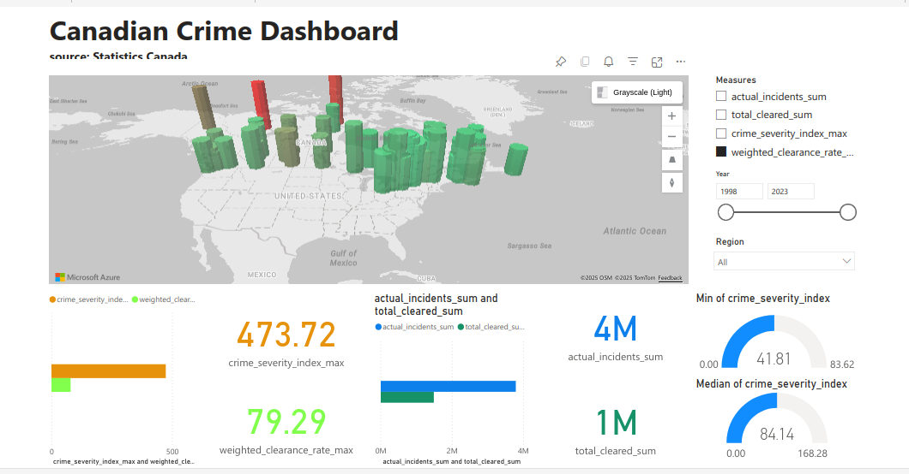

# canada_crime
To create a dashboard using Canadian crime data.

## Objective
To learn project management, collaboration using git, dashboard development, and CI/CD.

## Data
We will use publicly available data, e.g. data from Statistics Canada.

## Branching Rules
* main: will host tested code only.
* user_dev: will host any development code. User code has to be merged to main when fully tested.
* username_feature_name: will host any specific code worked on by a user for an agreed-upon feature. Feature code may be merged to username_dev or main once fully tested.

## Power-Bi screenshot

